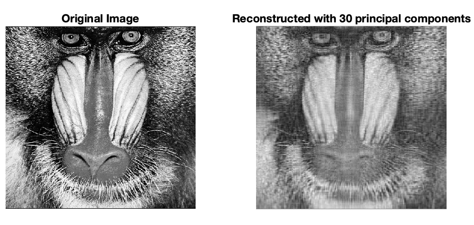

# PCA-for-Image-Compression-Reconstruction



*Figure 1: Side-by-side comparison of the original and compressed image.*

# PCA Image Compression

This project demonstrates **image compression using Principal Component Analysis (PCA)** on a grayscale version of the classic `mandrill` image provided by MATLAB. PCA reduces the dimensionality of image data by projecting it onto a lower-dimensional space, allowing reconstruction using only the most informative components.

## Applications
- **Deep Learning**: Feature engineering & dimensionality reduction
- **Digital Signal Processing**: Noise reduction and signal enhancement, e.g. EEG signal denoising
- **Computer Vision**: Core component of the **Eigenfaces** technique used for face recognition and efficient storage
- **Audio and speech processing**: Spectral feature extraction 

## How to Use

1. Open the `main.m` script file in MATLAB.
2. Modify the number of principal components used for reconstruction:
   ```matlab
   num_components = 30;

